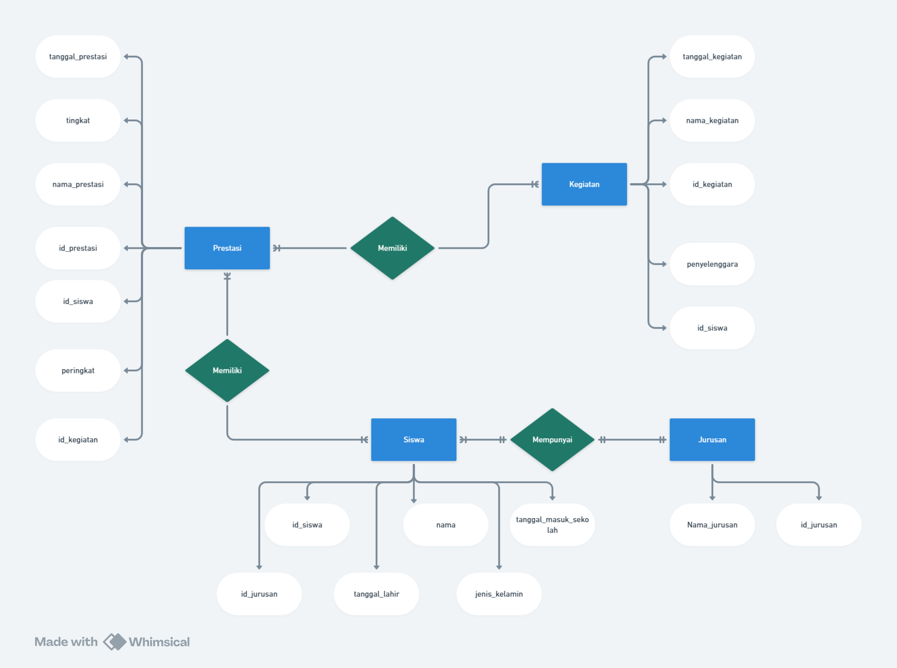
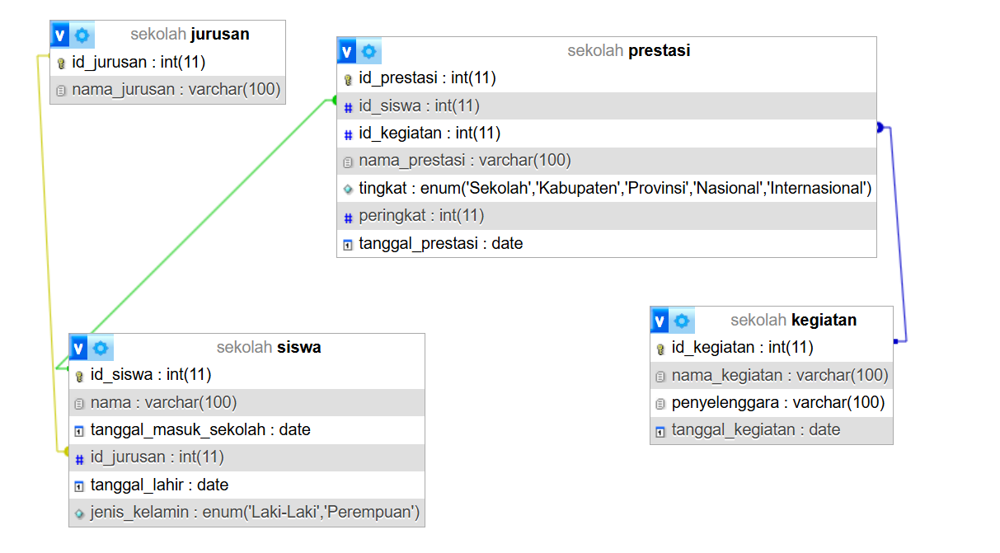
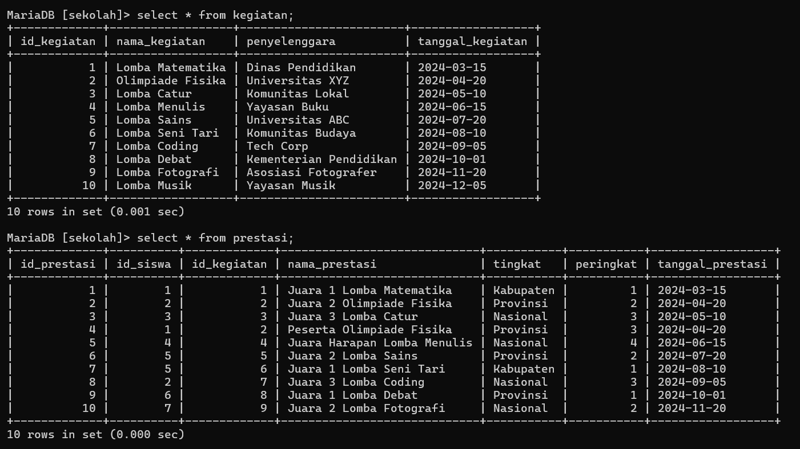
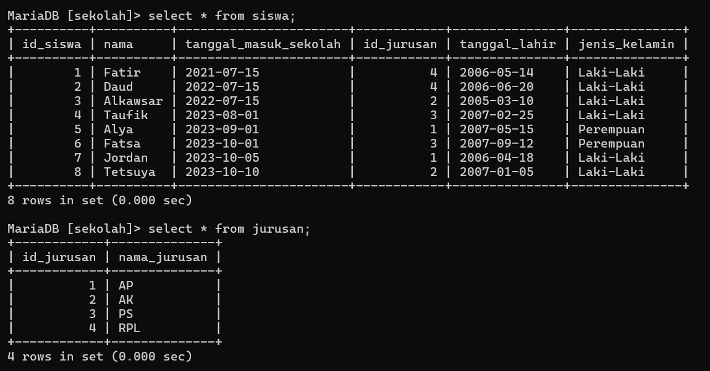
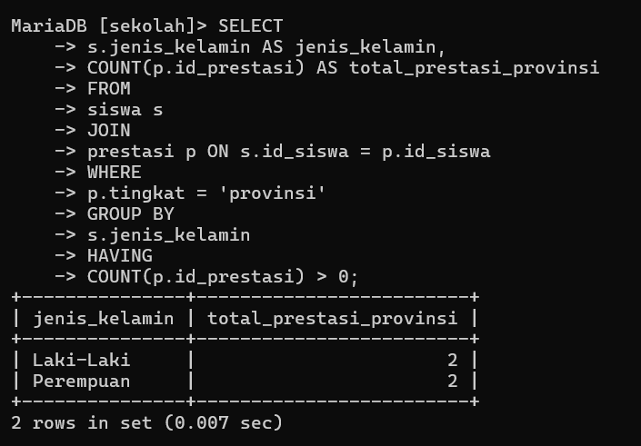
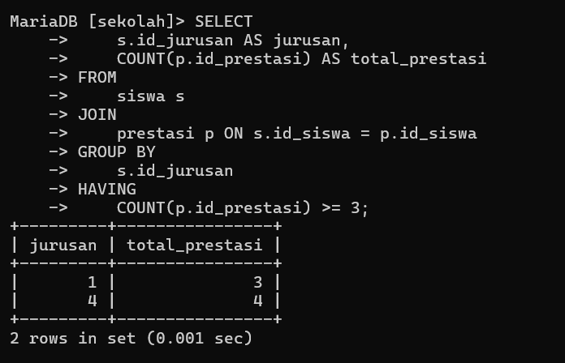
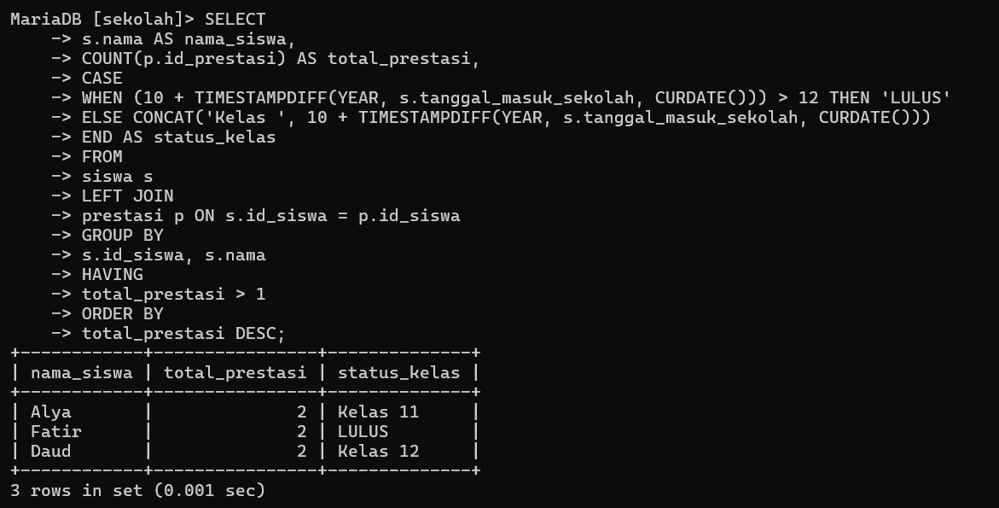

# Ujian

## Tabel Keaktifan
| No  | Nama   | Skor keaktifan | Peran             |
| --- | ------ | -------------- | ----------------- |
| 1   | Fatir  | 3              | Membuat ERD       |
| 2   | Farhan | 3              | Mencari query 1   |
| 3   | Daud   | 3              | Mencari query 2   |
| 4   | Nabil  | 3              | Membuat Database  |
| 5   | Afdal  | 0              | Tidak Mengerjakan |

## Soal 
1. Setiap kelompok merancang database di MySQL dari hasil perencanaan ERD-nya masing-masing. Di dalam database tersebut wajib menjadikan tabel berelasi, dengan menambah foreign key. 
2. Selanjutnya tampilkan datanya secara kontekstual dengan menggunakan query relasi, group by, dan having secara bersamaan dalam satu query. Buatlah minimal sebanyak 2 contoh. 
3. Sertakan pula penjelasan dan analisis kalian pada soal nomor 1 dan 2.

## Jawab

## ERD

### Penjelasan ERD

- **Entitas `siswa`**
    
    - **Atribut:**
        - `id_siswa` (primary key)
        - `nama`
        - `tanggal_lahir`
        - `jenis_kelamin`
        - `Tanggal_Masuk_sekolah`
        - `id_jurusan` (foreign key ke entitas `jurusan`)
    - Menggambarkan data siswa dalam sistem.

- **Entitas `jurusan`**
    
    - **Atribut:**
        - `id_jurusan` (primary key)
        - `Nama_Jurusan`
    - Menyimpan data jurusan yang diikuti siswa.

- **Entitas `prestasi`**
    
    - **Atribut:**
        - `id_prestasi` (primary key)
        - `tanggal_prestasi`
        - `nama_prestasi`
        - `tingkat` (misalnya, tingkat sekolah, regional, nasional)
        - `peringkat`
        - `id_siswa` (foreign key ke entitas `siswa`)
        - `id_kegiatan` (foreign key ke entitas `kegiatan`)
    - Berisi data tentang prestasi siswa, termasuk informasi terkait kegiatan yang relevan.

- **Entitas `kegiatan`**
    
    - **Atribut:**
        - `id_kegiatan` (primary key)
        - `tanggal_kegiatan`
        - `nama_kegiatan`
        - `penyelenggara`
    - Menyimpan data kegiatan yang dapat terkait dengan prestasi siswa.

- **Relasi `Memiliki`**
    
    - **Antara `siswa` dan `prestasi`:**
        - Menunjukkan bahwa seorang siswa dapat memiliki satu atau lebih prestasi.
    - **Antara `prestasi` dan `kegiatan`:**
        - Menunjukkan bahwa setiap prestasi dapat terkait dengan kegiatan tertentu.
- **Relasi `Mempunyai`**
    
    - **Antara `siswa` dan `jurusan`:**
        - Menunjukkan bahwa setiap siswa terdaftar di satu jurusan.
          
          

- **Siswa ↔ Prestasi**:
    - Relasi ini menunjukkan bahwa banyak siswa dapat memiliki banyak prestasi (M:M), dan banyak prestasi terkait dengan banyak siswa.
- **Prestasi ↔ Kegiatan**:
    - Relasi ini menunjukkan bahwa banyak prestasi dikaitkan dengan banyak kegiatan, dan banyak kegiatan bisa menghasilkan banyak prestasi (M:M).
- Relasi antara entitas `siswa` dan `jurusan` adalah **Many-to-One (M:1)**.
    - Banyak siswa bisa berada dalam satu jurusan, tetapi satu siswa hanya bisa berada dalam satu jurusan.  
        Hal ini terlihat dari atribut `id_jurusan` di entitas `siswa`, yang menjadi _foreign key_ ke entitas `jurusan`.
## Query Membuat DataBase dan Tabel Yang Berelasi

### Data Base
```sql
CREATE DATABASE sekolah;
USE sekolah;
```

### Tabel siswa
```sql
CREATE TABLE siswa (
id_siswa INT AUTO_INCREMENT PRIMARY KEY,
nama VARCHAR(100) NOT NULL,
tanggal_masuk_sekolah date NOT NULL,
id_jurusan int(11) NOT NULL,
tanggal_lahir DATE NOT NULL,
jenis_kelamin ENUM('Laki-Laki', 'Perempuan') NOT NULL
FOREIGN KEY (id_jurusan) REFERENCES jurusan(id_jurusan) ON DELETE CASCADE ON UPDATE CASCADE
);
```

### Tabel Prestasi
```sql
CREATE TABLE prestasi (
id_prestasi INT AUTO_INCREMENT PRIMARY KEY,
id_siswa INT NOT NULL,
id_kegiatan INT NOT NULL,
nama_prestasi VARCHAR(100) NOT NULL,
tingkat ENUM('Sekolah', 'Kabupaten', 'Provinsi', 'Nasional','Internasional') NOT NULL,
peringkat INT NOT NULL,
tanggal_prestasi DATE NOT NULL,
FOREIGN KEY (id_siswa) REFERENCES siswa(id_siswa) ON DELETE CASCADE ON UPDATE CASCADE,
FOREIGN KEY (id_kegiatan) REFERENCES kegiatan(id_kegiatan) ON DELETE CASCADE ON UPDATE CASCADE
);
```
### Tabel Kegiatan
```sql
CREATE TABLE kegiatan (
id_kegiatan INT AUTO_INCREMENT PRIMARY KEY,
nama_kegiatan VARCHAR(100) NOT NULL,
penyelenggara VARCHAR(100) NOT NULL,
tanggal_kegiatan DATE NOT NULL
);
```

### Tabel Jurusan
```sql
CREATE TABLE jurusan (
    id_jurusan INT AUTO_INCREMENT PRIMARY KEY,
    nama_jurusan VARCHAR(100) NOT NULL
);
```
## Relasi Data base

### Penjelasan
- **Tabel `siswa`** berisi data pribadi siswa yang berfungsi sebagai referensi untuk data prestasi.
- **Tabel `kegiatan`** menyimpan data kegiatan yang menjadi konteks untuk prestasi tertentu.
- **Tabel `prestasi`** menjadi tabel penghubung, mengintegrasikan informasi dari siswa dan kegiatan, serta mencatat detail prestasi seperti nama, tingkat, dan peringkat.
- **Tabel `Jurusan`** berisi jurusan yang ada 
### Relasi Antar Tabel Many-to-Many
1. Tabel siswa dengan prestasi
    - Banyak siswa  dapat memiliki banyak pr estasi begitu pula sebaliknya banyak prestasi memiliki banyak siswa

2. Tabel kegiatan dengan prestasi
    - Banyak kegiatan dapat memiliki banyak prestasi begitu pula sebaliknya banyak prestasi memiliki banyak kegiatan
### Relasi Antar Tabel Many-to-One (M:1)
- Relasi antara entitas `siswa` dan `jurusan` adalah **Many-to-One (M:1)**.
    - Banyak siswa bisa berada dalam satu jurusan, tetapi satu siswa hanya bisa berada dalam satu jurusan.  
        Hal ini terlihat dari atribut `id_jurusan` di entitas `siswa`, yang menjadi _foreign key_ ke entitas `jurusan`.
## Isi Data base



## 2 Contoh dengan menggunakan query relasi, group by, dan having secara bersamaan dalam satu query
### Query 1
tujuan : Menghitung berapa banyak prestasi tingkat **provinsi** yang diraih siswa, dibedakan berdasarkan **jenis kelamin**. Hasilnya hanya akan menampilkan jenis kelamin yang punya **minimal satu prestasi**.

cara relasi : menggunakan query  **`JOIN siswa s ON s.id_siswa = p.id_siswa`**: Menghubungkan tabel `siswa` dan `prestasi` berdasarkan kolom `id_siswa`.

cara agregasi : pertama kita harus memfilter data  
    `WHERE p.tingkat = 'provinsi'`  Hanya data prestasi tingkat _provinsi_ yang diproses.
- menghitung jumlah prestasi  
    `COUNT(p.id_prestasi)`  Menghitung jumlah prestasi untuk setiap kelompok jenis kelamin.
- **Kelompokkan Data:**  
    `GROUP BY s.jenis_kelamin`  Data dikelompokkan berdasarkan jenis kelamin siswa.
- **Tampilkan Kelompok dengan Prestasi:**  
    `HAVING COUNT(p.id_prestasi) > 0`  Hanya kelompok dengan jumlah prestasi > 0 yang ditampilkan.

#### Code
```sql
SELECT
s.jenis_kelamin AS jenis_kelamin,
COUNT(p.id_prestasi) AS total_prestasi_provinsi
FROM
siswa s
JOIN
prestasi p ON s.id_siswa = p.id_siswa
WHERE
p.tingkat = 'provinsi'
GROUP BY
s.jenis_kelamin
HAVING
COUNT(p.id_prestasi) > 0;
```
#### Hasil


#### Penjelasan dan Analisis

- `s.jenis_kelamin`: Memilih kolom `jenis_kelamin` dari tabel `siswa` (berarti kita ingin mengelompokkan data berdasarkan jenis kelamin).
-  `AS jenis_kelamin` Membuat tabel alias jenis_kelamin
- `COUNT(p.id_prestasi)`: Menghitung jumlah baris pada kolom `id_prestasi` di tabel `prestasi`. Hasilnya diberi alias `total_prestasi_provinsi`.
- `AS total_prestasi_provinsi` Membuat tabel alias 
- Menggabungkan tabel `siswa` (alias `s`) dengan tabel `prestasi` (alias `p`) berdasarkan relasi `s.id_siswa = p.id_siswa`.
- Artinya, kita ingin menghubungkan data siswa dengan prestasi yang mereka raih.
- `WHERE p.tingkat = 'provinsi'`Memfilter data agar hanya memasukkan prestasi dengan tingkat `'provinsi'`.
- `GROUP BY s.jenis_kelamin`Mengelompokkan data berdasarkan kolom `jenis_kelamin`.
- `HAVING COUNT(p.id_prestasi) > 0`Memfilter grup yang memiliki jumlah prestasi lebih dari 0.


### Query 2

tujuan: menghitung jumlah prestasi yang diraih oleh siswa dari setiap **jurusan**. Hasilnya hanya akan menampilkan jurusan yang punya **minimal 3 prestasi**.

cara relasi: menggunakan query `JOIN prestasi p ON s.id_siswa = p.id_siswa` menghubungkan tabel siswa dan tabel prestasi berdasarkan kolom `id_siswa`

cara agregasi: 1. **Pengelompokan Data (`GROUP BY`):**  
    Data akan dikelompokkan berdasarkan kolom `jurusan` dari tabel `siswa`.
2. **Menghitung Prestasi (`COUNT`):**  
    `COUNT(p.id_prestasi)` menghitung jumlah prestasi untuk setiap jurusan.
    
3. **Filter Hasil (`HAVING`):**  
    Hanya menampilkan jurusan yang memiliki **minimal 3 prestasi**.
    
#### Code
```sql
SELECT 
    s.id_jurusan AS jurusan,
    COUNT(p.id_prestasi) AS total_prestasi
FROM 
    siswa s
JOIN 
    prestasi p ON s.id_siswa = p.id_siswa
GROUP BY 
    s.id_jurusan
HAVING 
    COUNT(p.id_prestasi) >= 3;

```
#### Hasil


#### Penjelasan dan Analisis

- `SELECT s.id_jurusan`: Mengambil kolom `jurusan` dari tabel `siswa`. Artinya, kita ingin menampilkan data berdasarkan jurusan.
- `AS jurusan Membuat tabel alias 
- `COUNT(p.id_prestasi)`: Menghitung jumlah data di kolom `id_prestasi` dari tabel `prestasi`. Alias hasilnya adalah `total_prestasi`.
-  `AS total_prestasi` Membuat tabel alias 
-  `FROM siswa s JOIN prestasi p ON s.id_siswa = p.id_siswa`Melakukan **INNER JOIN** antara tabel `siswa` (alias `s`) dengan tabel `prestasi` (alias `p`) berdasarkan relasi `s.id_siswa = p.id_siswa`.
- Tujuan JOIN ini adalah untuk menghubungkan data siswa dengan prestasi yang mereka raih.
- `GROUP BY s.id_jurusan` Mengelompokkan data berdasarkan kolom `jurusan`. Dengan ini, semua siswa yang memiliki jurusan sama akan dikelompokkan untuk dihitung jumlah prestasinya.
- `HAVING COUNT(p.id_prestasi) >= 3` Memfilter hanya kelompok jurusan yang memiliki setidaknya **3 prestasi** Atau sama dengan 3 **prestasi**.


### Query 3

tujuan: Query ini digunakan untuk mendapatkan informasi tentang siswa beserta jumlah prestasi mereka, dan menentukan status mereka (lulus atau kelas saat ini) berdasarkan tahun masuk sekolah.

cara relasi:**`LEFT JOIN`**:
- Menyertakan semua data dari tabel `siswa`, meskipun tidak ada data terkait di tabel `prestasi`.
- Siswa yang tidak memiliki prestasi akan tetap muncul dengan nilai `NULL` pada kolom dari tabel `prestasi`.
- Relasi antara tabel `siswa` dan `prestasi` menggunakan kolom **`id_siswa`** sebagai kunci utama (`siswa`) dan kunci tamu (`prestasi`)

cara agregasi: 
- Agregasi dilakukan menggunakan fungsi **COUNT** untuk menghitung jumlah prestasi per siswa `COUNT(p.id_prestasi) AS total_prestasi`Fungsi **COUNT** menghitung jumlah baris pada tabel `prestasi` yang memiliki relasi dengan `id_siswa`.
- menggunakan **GROUP BY** untuk mengelompokkan hasil berdasarkan setiap siswa`GROUP BY s.id_siswa, s.nama` **`GROUP BY`** memastikan bahwa hasil dihitung per siswa.
- memfilter hasil `HAVING total_prestasi > 1` Menampilkan hanya siswa yang memiliki setidaknya dua prestasi.
- mengurutkan hassil `ORDER BY total_prestasi DESC` Mengurutkan hasil berdasarkan jumlah prestasi secara menurun.
#### Code
```sql
SELECT
s.nama AS nama_siswa,
COUNT(p.id_prestasi) AS total_prestasi,
CASE
WHEN (10 + TIMESTAMPDIFF(YEAR, s.tanggal_masuk_sekolah, CURDATE())) > 12 THEN 'LULUS'
ELSE CONCAT('Kelas ', 10 + TIMESTAMPDIFF(YEAR, s.tanggal_masuk_sekolah, CURDATE()))
END AS status_kelas
FROM
siswa s
LEFT JOIN
prestasi p ON s.id_siswa = p.id_siswa
GROUP BY
s.id_siswa, s.nama
HAVING
total_prestasi > 1
ORDER BY
total_prestasi DESC;
```
#### Hasil


#### Penjelasan dan Analisis

- **`SELECT s.nama`**:
    
    - Mengambil kolom `nama` dari tabel `siswa` untuk menampilkan nama siswa.
    - Kolom ini diberi alias **`AS nama_siswa`** agar lebih deskriptif di hasil query.
- **`COUNT(p.id_prestasi)`**:
    
    - Menghitung jumlah data di kolom `id_prestasi` dari tabel `prestasi` untuk setiap siswa.
    - Alias hasil perhitungan adalah **`AS total_prestasi`** agar lebih jelas.
- **`CASE`**:
    
    - Logika kondisional yang menentukan status kelas siswa berdasarkan waktu sejak masuk sekolah:
        - **`WHEN`**: Jika waktu masuk sekolah lebih dari 12 tahun yang lalu, statusnya "LULUS".
        - **`ELSE`**: Jika belum 12 tahun, status berupa kelas saat ini (contohnya "kelas 11").
    - Alias untuk hasil logika adalah **`AS status_kelas`**.
- **`FROM siswa s`**:
    
    - Menentukan tabel `siswa` sebagai sumber data utama dengan alias **`s`**.
- **`LEFT JOIN prestasi p ON s.id_siswa = p.id_siswa`**:
    
    - Melakukan **LEFT JOIN** antara tabel `siswa` (alias `s`) dengan tabel `prestasi` (alias `p`) berdasarkan relasi `s.id_siswa = p.id_siswa`.
    - Tujuan JOIN adalah menghubungkan setiap siswa dengan prestasi mereka (jika ada).
- **`GROUP BY s.id_siswa, s.nama`**:
    
    - Mengelompokkan data berdasarkan `id_siswa` dan `nama` untuk menghitung jumlah prestasi per siswa.
- **`HAVING total_prestasi > 1`**:
    
    - Memfilter hasil agar hanya menampilkan siswa yang memiliki setidaknya **2 prestasi**.
- **`ORDER BY total_prestasi DESC`**:
    
    - Mengurutkan hasil berdasarkan jumlah prestasi secara menurun (siswa dengan prestasi terbanyak ditampilkan di atas).


