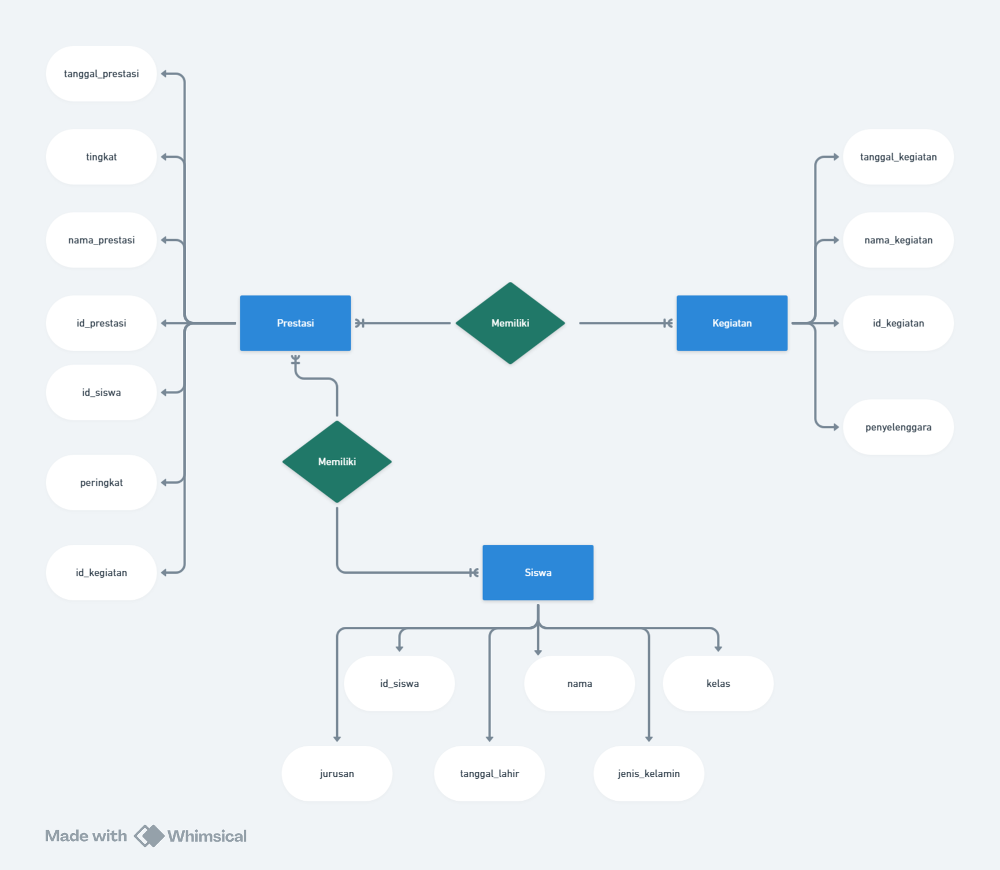
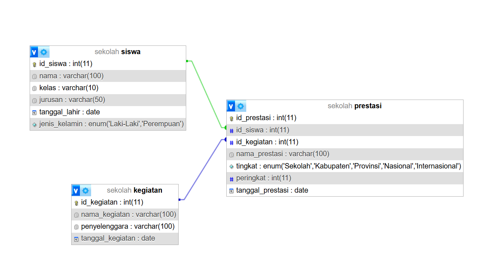
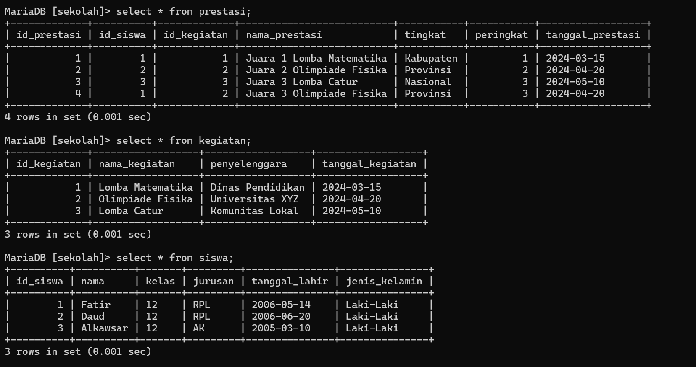

# Ujian

## Tabel Keaktifan
| No  | Nama   | Skor keaktifan | Peran             |
| --- | ------ | -------------- | ----------------- |
| 1   | Fatir  | 3              | Membuat ERD       |
| 2   | Farhan | 3              | Mencari query 1   |
| 3   | Daud   | 3              | Mencari query 2   |
| 4   | Nabil  | 3              | Membuat Database  |
| 5   | Afdal  | 0              | Tidak Mengerjakan |

## Soal 
1. Setiap kelompok merancang database di MySQL dari hasil perencanaan ERD-nya masing-masing. Di dalam database tersebut wajib menjadikan tabel berelasi, dengan menambah foreign key. 
2. Selanjutnya tampilkan datanya secara kontekstual dengan menggunakan query relasi, group by, dan having secara bersamaan dalam satu query. Buatlah minimal sebanyak 2 contoh. 
3. Sertakan pula penjelasan dan analisis kalian pada soal nomor 1 dan 2.

## Jawab

## ERD

### Penjelasan ERD

- **Siswa ↔ Prestasi**:
    - Relasi ini menunjukkan bahwa banyak siswa dapat memiliki banyak prestasi (M:M), dan banyak prestasi terkait dengan banyak siswa.
- **Prestasi ↔ Kegiatan**:
    - Relasi ini menunjukkan bahwa banyak prestasi dikaitkan dengan banyak kegiatan, dan banyak kegiatan bisa menghasilkan banyak prestasi (M:M).
## Query Membuat DataBase dan Tabel Yang Berelasi

### Data Base
```sql
CREATE DATABASE sekolah;
USE sekolah;
```

### Tabel siswa
```sql
CREATE TABLE siswa (
id_siswa INT AUTO_INCREMENT PRIMARY KEY,
nama VARCHAR(100) NOT NULL,
kelas VARCHAR(10) NOT NULL,
jurusan VARCHAR(50) NOT NULL,
tanggal_lahir DATE NOT NULL,
jenis_kelamin ENUM('Laki-Laki', 'Perempuan') NOT NULL
);
```

### Tabel Prestasi
```sql
CREATE TABLE prestasi (
id_prestasi INT AUTO_INCREMENT PRIMARY KEY,
id_siswa INT NOT NULL,
id_kegiatan INT NOT NULL,
nama_prestasi VARCHAR(100) NOT NULL,
tingkat ENUM('Sekolah', 'Kabupaten', 'Provinsi', 'Nasional','Internasional') NOT NULL,
peringkat INT NOT NULL,
tanggal_prestasi DATE NOT NULL,
FOREIGN KEY (id_siswa) REFERENCES siswa(id_siswa) ON DELETE CASCADE ON UPDATE CASCADE,
FOREIGN KEY (id_kegiatan) REFERENCES kegiatan(id_kegiatan) ON DELETE CASCADE ON UPDATE CASCADE
);
```
### Tabel Kegiatan
```sql
CREATE TABLE kegiatan (
id_kegiatan INT AUTO_INCREMENT PRIMARY KEY,
nama_kegiatan VARCHAR(100) NOT NULL,
penyelenggara VARCHAR(100) NOT NULL,
tanggal_kegiatan DATE NOT NULL
);
```
## Relasi Data base

### Penjelasan
- **Tabel `siswa`** berisi data pribadi siswa yang berfungsi sebagai referensi untuk data prestasi.
- **Tabel `kegiatan`** menyimpan data kegiatan yang menjadi konteks untuk prestasi tertentu.
- **Tabel `prestasi`** menjadi tabel penghubung, mengintegrasikan informasi dari siswa dan kegiatan, serta mencatat detail prestasi seperti nama, tingkat, dan peringkat.
### Relasi Antar Tabel Many-to-Many
1. Tabel siswa dengan prestasi
    - Banyak siswa  dapat memiliki banyak pr estasi begitu pula sebaliknya banyak prestasi memiliki banyak siswa

2. Tabel kegiatan dengan prestasi
    - Banyak kegiatan dapat memiliki banyak prestasi begitu pula sebaliknya banyak prestasi memiliki banyak kegiatan
## Isi Data base


## 2 Contoh dengan menggunakan query relasi, group by, dan having secara bersamaan dalam satu query
### Query 1
tujuan : Menghitung berapa banyak prestasi tingkat **provinsi** yang diraih siswa, dibedakan berdasarkan **jenis kelamin**. Hasilnya hanya akan menampilkan jenis kelamin yang punya **minimal satu prestasi**.

cara relasi : menggunakan query  **`JOIN siswa s ON s.id_siswa = p.id_siswa`**: Menghubungkan tabel `siswa` dan `prestasi` berdasarkan kolom `id_siswa`.

cara agregasi : pertama kita harus memfilter data  
    `WHERE p.tingkat = 'provinsi'`  Hanya data prestasi tingkat _provinsi_ yang diproses.
- menghitung jumlah prestasi  
    `COUNT(p.id_prestasi)`  Menghitung jumlah prestasi untuk setiap kelompok jenis kelamin.
- **Kelompokkan Data:**  
    `GROUP BY s.jenis_kelamin`  Data dikelompokkan berdasarkan jenis kelamin siswa.
- **Tampilkan Kelompok dengan Prestasi:**  
    `HAVING COUNT(p.id_prestasi) > 0`  Hanya kelompok dengan jumlah prestasi > 0 yang ditampilkan.

#### Code
```sql
SELECT
s.jenis_kelamin AS jenis_kelamin,
COUNT(p.id_prestasi) AS total_prestasi_provinsi
FROM
siswa s
JOIN
prestasi p ON s.id_siswa = p.id_siswa
WHERE
p.tingkat = 'provinsi'
GROUP BY
s.jenis_kelamin
HAVING
COUNT(p.id_prestasi) > 0;
```
#### Hasil


#### Penjelasan dan Analisis
##### Penjelasan
- `s.jenis_kelamin`: Memilih kolom `jenis_kelamin` dari tabel `siswa` (berarti kita ingin mengelompokkan data berdasarkan jenis kelamin).
-  `AS jenis_kelamin` Membuat tabel alias jenis_kelamin
- `COUNT(p.id_prestasi)`: Menghitung jumlah baris pada kolom `id_prestasi` di tabel `prestasi`. Hasilnya diberi alias `total_prestasi_provinsi`.
- `AS total_prestasi_provinsi` Membuat tabel alias 
- Menggabungkan tabel `siswa` (alias `s`) dengan tabel `prestasi` (alias `p`) berdasarkan relasi `s.id_siswa = p.id_siswa`.
- Artinya, kita ingin menghubungkan data siswa dengan prestasi yang mereka raih.
- `WHERE p.tingkat = 'provinsi'`Memfilter data agar hanya memasukkan prestasi dengan tingkat `'provinsi'`.
- `GROUP BY s.jenis_kelamin`Mengelompokkan data berdasarkan kolom `jenis_kelamin`.
- `HAVING COUNT(p.id_prestasi) > 0`Memfilter grup yang memiliki jumlah prestasi lebih dari 0.
##### Analisis

###### 1. **Hasil Yang akan di tampilkan**

- Terdapat dua kolom dalam hasil:
    - **`jenis_kelamin`**: Menunjukkan jenis kelamin siswa (misalnya, `'Laki-Laki'` atau `'Perempuan'`).
    - **`total_prestasi_provinsi`**: Menunjukkan jumlah prestasi tingkat provinsi yang diraih oleh siswa dengan jenis kelamin tersebut.

###### 2. **Efisiensi Query**
- Query cukup efisien untuk database yang tidak terlalu besar.


### Query 2

tujuan: menghitung jumlah prestasi yang diraih oleh siswa dari setiap **jurusan**. Hasilnya hanya akan menampilkan jurusan yang punya **minimal 3 prestasi**.

cara relasi: menggunakan query `JOIN prestasi p ON s.id_siswa = p.id_siswa` menghubungkan tabel siswa dan tabel prestasi berdasarkan kolom `id_siswa`

cara agregasi: 1. **Pengelompokan Data (`GROUP BY`):**  
    Data akan dikelompokkan berdasarkan kolom `jurusan` dari tabel `siswa`.
2. **Menghitung Prestasi (`COUNT`):**  
    `COUNT(p.id_prestasi)` menghitung jumlah prestasi untuk setiap jurusan.
    
3. **Filter Hasil (`HAVING`):**  
    Hanya menampilkan jurusan yang memiliki **minimal 3 prestasi**.
    
#### Code
```sql
SELECT 
    s.jurusan AS jurusan,
    COUNT(p.id_prestasi) AS total_prestasi
FROM 
    siswa s
JOIN 
    prestasi p ON s.id_siswa = p.id_siswa
GROUP BY 
    s.jurusan
HAVING 
    COUNT(p.id_prestasi) >= 3; 
```
#### Hasil


#### Penjelasan dan Analisis
##### Penjelasan
- `SELECT s.jurusan`: Mengambil kolom `jurusan` dari tabel `siswa`. Artinya, kita ingin menampilkan data berdasarkan jurusan.
- `AS jurusan Membuat tabel alias 
- `COUNT(p.id_prestasi)`: Menghitung jumlah data di kolom `id_prestasi` dari tabel `prestasi`. Alias hasilnya adalah `total_prestasi`.
-  `AS total_prestasi` Membuat tabel alias 
-  `FROM siswa s JOIN prestasi p ON s.id_siswa = p.id_siswa`Melakukan **INNER JOIN** antara tabel `siswa` (alias `s`) dengan tabel `prestasi` (alias `p`) berdasarkan relasi `s.id_siswa = p.id_siswa`.
- Tujuan JOIN ini adalah untuk menghubungkan data siswa dengan prestasi yang mereka raih.
- `GROUP BY s.jurusan` Mengelompokkan data berdasarkan kolom `jurusan`. Dengan ini, semua siswa yang memiliki jurusan sama akan dikelompokkan untuk dihitung jumlah prestasinya.
- `HAVING COUNT(p.id_prestasi) >= 3` Memfilter hanya kelompok jurusan yang memiliki setidaknya **3 prestasi** Atau sama dengan 3 **prestasi**.
##### Analisis
###### 1. **Tujuan Query**

- Query ini digunakan untuk mendapatkan daftar jurusan yang memiliki **setidaknya 3 prestasi** yang diraih oleh siswa dalam jurusan tersebut.
- Informasi ini membantu untuk melihat jurusan mana yang lebih produktif atau aktif dalam hal prestasi.

###### 2. **Keluaran Query**

- Hasilnya terdiri dari dua kolom:
    - **`jurusan`**: Nama jurusan.
    - **`total_prestasi`**: Total jumlah prestasi yang diraih oleh siswa dari jurusan tersebut.

###### 3. **Efisiensi Query**

- Query ini cukup efisien untuk database yang tidak terlalu besar.


