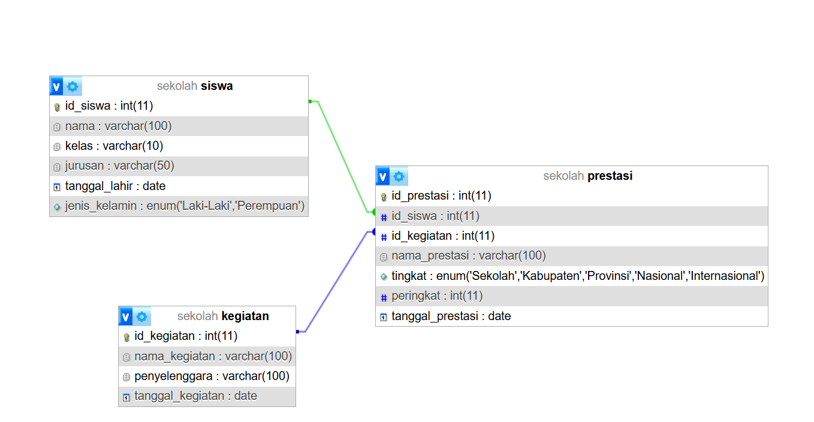
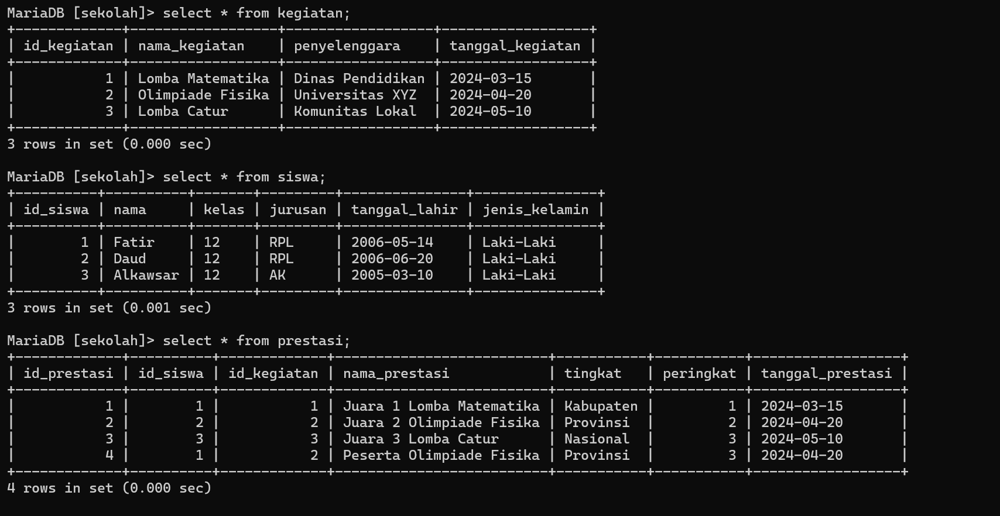
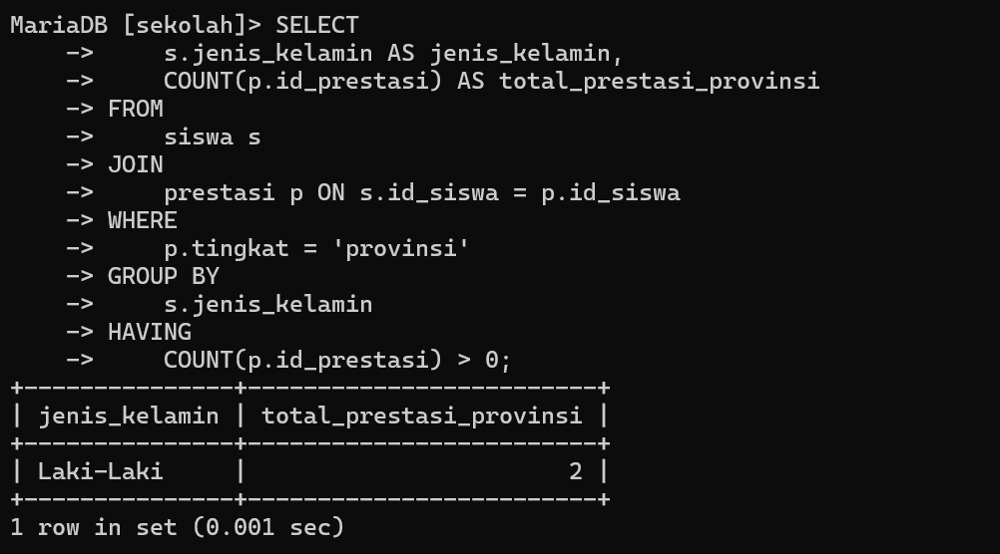
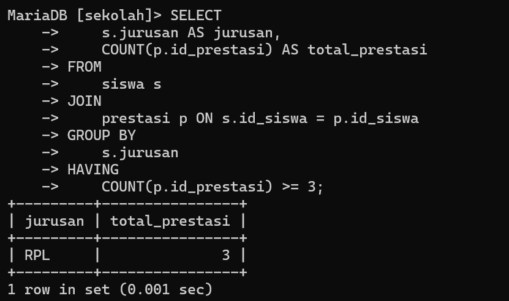

# Ujian

## Tabel Keaktifan
| No  | Nama   | Skor keaktifan | Peran                                 |
| --- | ------ | -------------- | ------------------------------------- |
| 1   | Fatir  | 3              | Mengerjakan Materi dan Mencari Materi |
| 2   | Farhan | 3              | Mencari Materi                        |
| 3   | Daud   | 3              | Mencari Materi                        |
| 4   | Nabil  | 3              | Mencari Materi                        |
| 5   | Afdal  | 0              | Tidak Mengerjakan                     |

## Soal 
1. Setiap kelompok merancang database di MySQL dari hasil perencanaan ERD-nya masing-masing. Di dalam database tersebut wajib menjadikan tabel berelasi, dengan menambah foreign key. 
2. Selanjutnya tampilkan datanya secara kontekstual dengan menggunakan query relasi, group by, dan having secara bersamaan dalam satu query. Buatlah minimal sebanyak 2 contoh. 
3. Sertakan pula penjelasan dan analisis kalian pada soal nomor 1 dan 2.

## Jawab

## Query Membuat DataBase dan Tabel Yang Berelasi

### Data Base
```sql
CREATE DATABASE sekolah;
USE sekolah
```

### Tabel siswa
```sql
CREATE TABLE siswa (
id_siswa INT AUTO_INCREMENT PRIMARY KEY,
nama VARCHAR(100) NOT NULL,
kelas VARCHAR(10) NOT NULL,
jurusan VARCHAR(50) NOT NULL,
tanggal_lahir DATE NOT NULL,
jenis_kelamin ENUM('Laki-Laki', 'Perempuan') NOT NULL
);
```

### Tabel Prestasi
```sql
CREATE TABLE prestasi (
id_prestasi INT AUTO_INCREMENT PRIMARY KEY,
id_siswa INT NOT NULL,
id_kegiatan INT NOT NULL,
nama_prestasi VARCHAR(100) NOT NULL,
tingkat ENUM('Sekolah', 'Kabupaten', 'Provinsi', 'Nasional','Internasional') NOT NULL,
peringkat INT NOT NULL,
tanggal_prestasi DATE NOT NULL,
FOREIGN KEY (id_siswa) REFERENCES siswa(id_siswa) ON DELETE CASCADE ON UPDATE CASCADE,
FOREIGN KEY (id_kegiatan) REFERENCES kegiatan(id_kegiatan) ON DELETE CASCADE ON UPDATE CASCADE
);
```

```sql
CREATE TABLE kegiatan (
id_kegiatan INT AUTO_INCREMENT PRIMARY KEY,
nama_kegiatan VARCHAR(100) NOT NULL,
penyelenggara VARCHAR(100) NOT NULL,
tanggal_kegiatan DATE NOT NULL
);
```
## Relasi Data base


## Isi Data base


## 2 Contoh dengan menggunakan query relasi, group by, dan having secara bersamaan dalam satu query
### Query 1
#### Code
```sql
SELECT
s.jenis_kelamin AS jenis_kelamin,
COUNT(p.id_prestasi) AS total_prestasi_provinsi
FROM
siswa s
JOIN
prestasi p ON s.id_siswa = p.id_siswa
WHERE
p.tingkat = 'provinsi'
GROUP BY
s.jenis_kelamin
HAVING
COUNT(p.id_prestasi) > 0;
```
#### Hasil


#### Penjelasan dan Analisis
##### Penjelasan
- `s.jenis_kelamin`: Memilih kolom `jenis_kelamin` dari tabel `siswa` (berarti kita ingin mengelompokkan data berdasarkan jenis kelamin).
-  `AS jenis_kelamin` Membuat tabel alias jenis_kelamin
- `COUNT(p.id_prestasi)`: Menghitung jumlah baris pada kolom `id_prestasi` di tabel `prestasi`. Hasilnya diberi alias `total_prestasi_internasional`.
- `AS total_prestasi_provinsi` Membuat tabel alias 
- Menggabungkan tabel `siswa` (alias `s`) dengan tabel `prestasi` (alias `p`) berdasarkan relasi `s.id_siswa = p.id_siswa`.
- Artinya, kita ingin menghubungkan data siswa dengan prestasi yang mereka raih.
- `WHERE p.tingkat = 'provinsi'`Memfilter data agar hanya memasukkan prestasi dengan tingkat `'provinsi'`.
- `GROUP BY s.jenis_kelamin`Mengelompokkan data berdasarkan kolom `jenis_kelamin`.
- `HAVING COUNT(p.id_prestasi) > 0`Memfilter grup yang memiliki jumlah prestasi lebih dari 0.
##### Analisis
###### 1. **Tujuan Query**

- Query ini menghitung jumlah prestasi tingkat **provinsi** yang diraih oleh siswa berdasarkan **jenis kelamin**.
- Hanya jenis kelamin yang memiliki **setidaknya satu prestasi** yang akan ditampilkan.

###### 2. **Keluaran Query**

- Terdapat dua kolom dalam hasil:
    - **`jenis_kelamin`**: Menunjukkan jenis kelamin siswa (misalnya, `'Laki-Laki'` atau `'Perempuan'`).
    - **`total_prestasi_internasional`**: Menunjukkan jumlah prestasi tingkat provinsi yang diraih oleh siswa dengan jenis kelamin tersebut.

###### 3. **Efisiensi Query**

- Query cukup efisien untuk dataset yang tidak terlalu besar.
- Namun, jika tabel `prestasi` atau `siswa` memiliki banyak data, menambahkan **index** pada kolom `id_siswa` dan `tingkat` dapat meningkatkan performa.

###### 4. **Potensi Kesalahan**

- Jika ada siswa yang tidak memiliki data prestasi sama sekali, mereka akan terabaikan karena JOIN bersifat **INNER JOIN**. Jika semua siswa perlu dimasukkan, maka gunakan **LEFT JOIN**.

###### 5. **Optimisasi Potensial**

- Jika hanya memerlukan data jenis kelamin dan jumlah, bisa menggunakan subquery untuk memfilter data tingkat `provinsi` terlebih dahulu, agar lebih mudah dikelola pada dataset besar.

### Query 2
#### Code
```sql
SELECT 
    s.jurusan AS jurusan,
    COUNT(p.id_prestasi) AS total_prestasi
FROM 
    siswa s
JOIN 
    prestasi p ON s.id_siswa = p.id_siswa
GROUP BY 
    s.jurusan
HAVING 
    COUNT(p.id_prestasi) >= 3; 
```
#### Hasil


#### Penjelasan dan Analisis
##### Penjelasan
- `SELECT s.jurusan`: Mengambil kolom `jurusan` dari tabel `siswa`. Artinya, kita ingin menampilkan data berdasarkan jurusan.
- `AS jurusan Membuat tabel alias 
- `COUNT(p.id_prestasi)`: Menghitung jumlah data di kolom `id_prestasi` dari tabel `prestasi`. Alias hasilnya adalah `total_prestasi`.
-  `AS total_prestasi` Membuat tabel alias 
-  `FROM siswa s JOIN prestasi p ON s.id_siswa = p.id_siswa`Melakukan **INNER JOIN** antara tabel `siswa` (alias `s`) dengan tabel `prestasi` (alias `p`) berdasarkan relasi `s.id_siswa = p.id_siswa`.
- Tujuan JOIN ini adalah untuk menghubungkan data siswa dengan prestasi yang mereka raih.
- `GROUP BY s.jurusan` Mengelompokkan data berdasarkan kolom `jurusan`. Dengan ini, semua siswa yang memiliki jurusan sama akan dikelompokkan untuk dihitung jumlah prestasinya.
- `HAVING COUNT(p.id_prestasi) >= 3` Memfilter hanya kelompok jurusan yang memiliki setidaknya **3 prestasi** Atau sama dengan 3 **prestasi**.
##### Analisis
###### 1. **Tujuan Query**

- Query ini digunakan untuk mendapatkan daftar jurusan yang memiliki **setidaknya 3 prestasi** yang diraih oleh siswa dalam jurusan tersebut.
- Informasi ini membantu untuk melihat jurusan mana yang lebih produktif atau aktif dalam hal prestasi.

###### 2. **Keluaran Query**

- Hasilnya terdiri dari dua kolom:
    - **`jurusan`**: Nama jurusan.
    - **`total_prestasi`**: Total jumlah prestasi yang diraih oleh siswa dari jurusan tersebut.

###### 3. **Efisiensi Query**

- Query ini cukup efisien untuk dataset menengah.
- Jika tabel `prestasi` atau `siswa` sangat besar, menambahkan **index** pada kolom yang digunakan untuk JOIN (`id_siswa`) dapat meningkatkan performa.

###### 4. **Keterbatasan**:

- **INNER JOIN**: Hanya siswa yang memiliki data di tabel `prestasi` yang akan dihitung. Siswa tanpa prestasi tidak akan masuk hitungan.
- Jika ingin menyertakan semua jurusan (meskipun prestasinya kurang dari 3), gunakan **LEFT JOIN** dan ubah filter dalam HAVING seperti:
```sql
HAVING COUNT(p.id_prestasi) >= 3
```

###### 5. **Optimisasi Potensial**

- Jika kita tahu bahwa dataset sangat besar, filtering pada tahap awal dengan **WHERE** dapat membantu, misalnya memfilter data prestasi yang relevan.